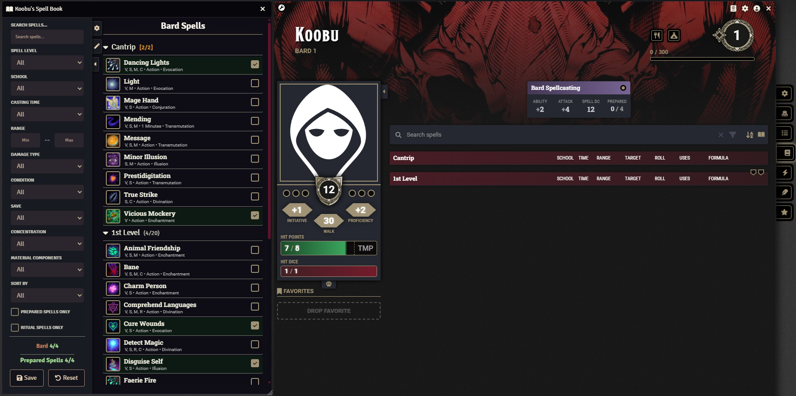
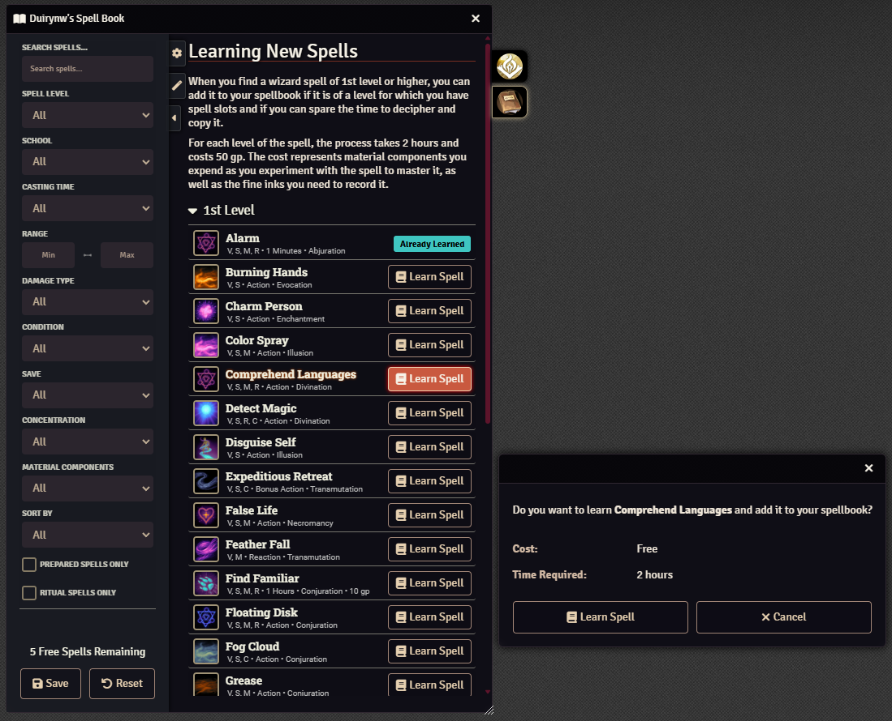
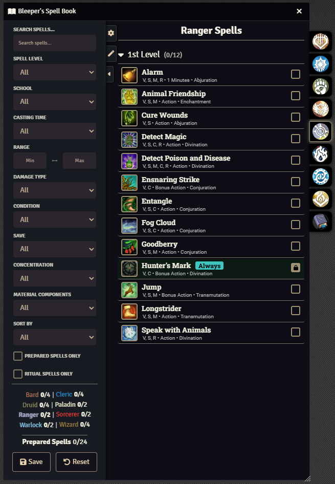
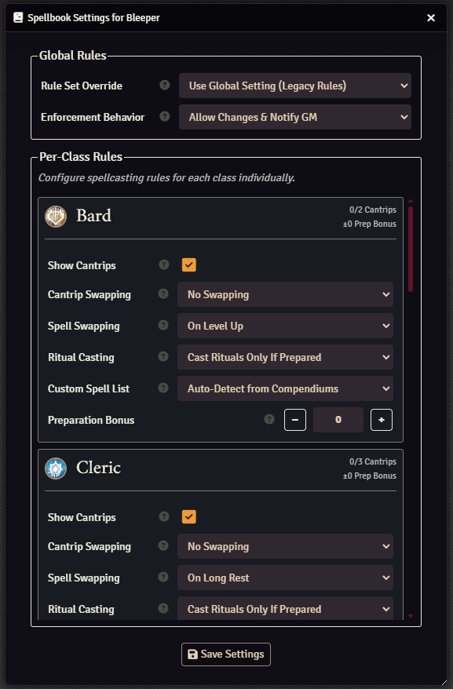
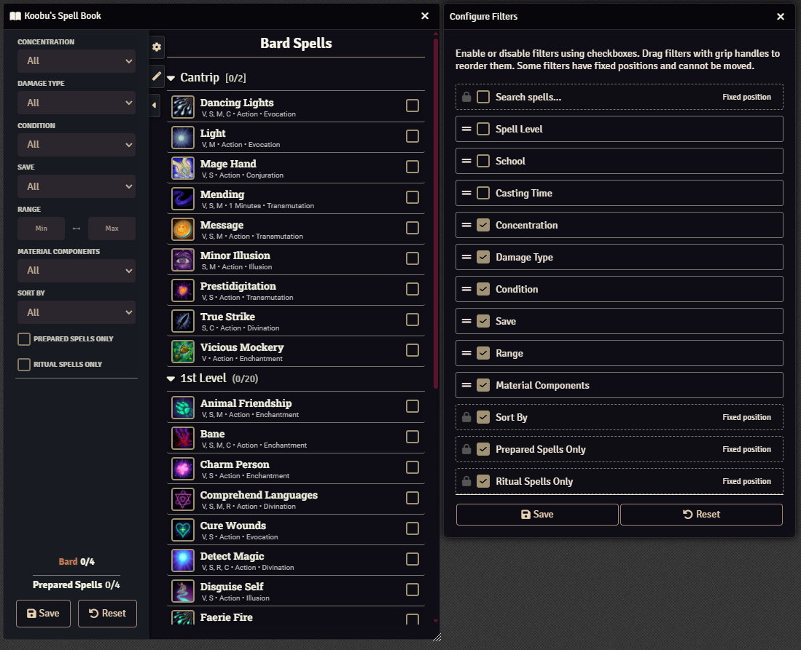
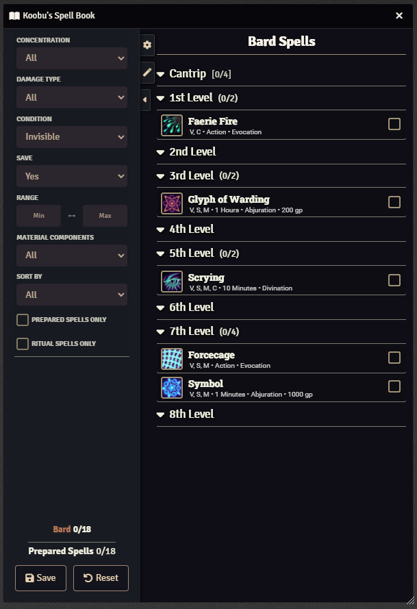
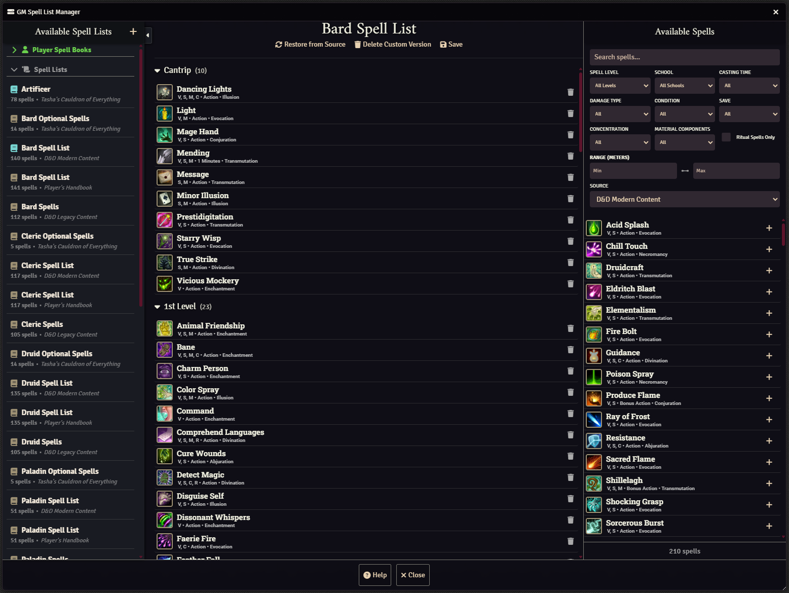

# Spell Book

## Supporting The Module

## Introduction

**Spell Book** revolutionizes spell management in FoundryVTT! Navigate your character's magical arsenal with ease through our intuitive interface that fully supports both 2014 and 2024 D&D rules. From preparation to casting, Spell Book handles everything in one centralized location with complete multiclass support and class-specific rule customization.

Say goodbye to endless compendium searches and confusing spell tracking. **Spell Book** streamlines the entire process so you can focus on what matters—unleashing arcane power in your adventures!

---

## Key Features

### 🎯 **Complete Rule Set Support**

- **2014 Legacy Rules**: Traditional spellcasting with no cantrip swapping
- **2024 Modern Rules**: Updated rules with cantrip swapping on level-up
- **Flexible Enforcement**: Choose between trusting players, GM notifications, or full rule enforcement

### 🏛️ **Class-Specific Spell Management**

- **Individual Class Tabs**: Each spellcasting class gets its own dedicated interface
- **PHB-Accurate Defaults**: Proper implementation of Player's Handbook rules for all classes
- **Customizable Rules**: GMs can override any rule on a per-class basis, even for multiclass characters
- **Independent Tracking**: Spell preparation and limits tracked separately for each class

### 🧙‍♂️ **Advanced Wizard Features**

- **Personal Spellbook**: Dedicated tab for learning and managing wizard spells
- **Spell Learning System**: Track free spells per level and purchased spells with cost reminders
- **Ritual Casting Integration**: Automatic ritual spell management based on your spellbook

### 🔧 **Powerful GM Tools**

- **Spell List Manager**: Create, edit, and customize spell lists for any class or character
- **Custom Spell Lists**: Build entirely new spell lists or modify existing ones
- **Player Spellbook Access**: View and manage individual character spellbooks

### ⚙️ **Intelligent Automation**

- **Smart Compendium Integration**: Automatically pulls spells from your compendiums
- **Long Rest Integration**: Optional prompts for spell swapping when appropriate
- **Filter & Search**: Advanced filtering system with customizable options
- **Visual Indicators**: Clear status showing for prepared spells, always-prepared spells, and class sources

---

## Installation

Get Spell Book through Foundry's **Module Manager** or **The Forge's Bazaar** for instant setup.

### Manual Installation

1. Open **Foundry's Configuration and Setup** screen
2. Click **Install Module** in the Add-on Modules section
3. Paste this URL in the **Manifest URL** field:

[https://github.com/Sayshal/spell-book/releases/latest/download/module.json](https://github.com/Sayshal/spell-book/releases/latest/download/module.json)

4. Click **Install**
5. Enable Spell Book in the **Manage Modules** section

---

## Player Features

### Spell Preparation Made Easy

The main spell book interface provides everything you need to manage your character's spells:

- **Class-Specific Tabs**: Each spellcasting class gets its own organized tab
- **Preparation Tracking**: Visual indicators show prepared vs. available spells
- **Limit Enforcement**: Automatic tracking of preparation limits with clear feedback
- **Smart Filtering**: Find spells quickly with advanced search and filter options

### Rule Set Flexibility

Choose the rule set that matches your campaign:

- **Legacy (2014 Rules)**: Traditional D&D spellcasting where cantrips are permanent choices
- **Modern (2024 Rules)**: Updated rules allowing cantrip swapping on level-up

### Advanced Spell Swapping

Customize when and how spells can be changed:

- **Never**: Spells are permanent choices (traditional style)
- **On Level-Up**: Swap one spell when you gain a level
- **On Long Rest**: Change spells during long rests (like clerics and druids)

### Wizard Spellbook System

Wizards get special treatment with a dedicated spellbook tab:

- **Spell Learning**: Learn new spells with proper cost and time tracking
- **Free vs. Purchased**: Automatic tracking of free spells per level vs. spells copied from scrolls or other sources
- **Spellbook Preparation**: Only prepare spells you've actually learned
- **Ritual Integration**: Automatically access ritual spells from your spellbook

### Multiclass Support

Playing a multiclass spellcaster? No problem:

- **Independent Management**: Each class maintains its own spell list and preparation rules
- **Separate Limits**: Preparation limits tracked per class
- **Class-Specific Rules**: Different swapping rules can apply to each of your classes
- **Clear Organization**: Easy-to-navigate tabs keep everything organized

---

## GM Features

### Spell List Management

Take complete control over spell lists in your campaign:

- **Edit Existing Lists**: Modify any spell list from any compendium
- **Create Custom Lists**: Build entirely new spell lists for homebrew classes or variants
- **Player Integration**: Custom lists automatically appear in player spell books
- **Version Tracking**: See when original spell lists have been updated

### Enforcement Options

Choose how strictly the module enforces spellcasting rules:

- **Unenforced**: Trust your players completely - no restrictions applied
- **Notify GM**: Rules aren't enforced, but you receive whispered notifications about changes
- **Enforced**: Full rule enforcement with locked checkboxes when limits are reached

### Class Customization

Fine-tune spellcasting rules for any class:

- **Cantrip Rules**: Set when and how cantrips can be swapped
- **Spell Swapping**: Control leveled spell changing rules
- **Ritual Casting**: Configure ritual spell access and requirements
- **Preparation Bonuses**: Add or subtract from base preparation limits
- **Custom Spell Lists**: Assign custom spell lists to specific classes
- **Cantrip Visibility**: Hide cantrips for classes like Paladin and Ranger

---

## Configuration

### Quick Setup

1. **Choose Your Rule Set**: Select Legacy (2014) or Modern (2024) rules in module settings
2. **Set Enforcement Level**: Decide how strictly to enforce spellcasting limits
3. **Customize Classes**: Use the per-character settings to fine-tune individual classes
4. **Configure Filters**: Customize which spell filters appear in the interface

### Per-Character Settings

Access detailed spellcasting configuration through the character sheet's spell book:

- **Global Rule Override**: Override the world default for this character
- **Class-Specific Rules**: Customize cantrip swapping, spell swapping, ritual casting, and more for each class
- **Preparation Bonuses**: Adjust spell preparation limits up or down
- **Custom Spell Lists**: Assign homebrew or modified spell lists to specific classes

---

## Integration

### System Compatibility

- **DnD5e System**: Fully integrated with the official D&D 5e system
- **Tidy5e Sheets**: Native integration with Tidy5e character sheets
- **Long Rest Hooks**: Automatic integration with rest mechanics

### Compendium Support

- **Automatic Detection**: Finds spell lists from any installed compendium
- **Smart Organization**: Groups spell lists by source and type
- **Custom Mapping**: Link original spell lists to your customized versions

---

## Why Spell Book?

Spell Book transforms spell management from a tedious process to an engaging experience. Instead of:

- Manually tracking different preparation rules for each class
- Forgetting which spells each class knows vs. has prepared
- Struggling with multiclass spellcasting complexity
- Flipping through rulebooks for spell swapping rules

You get a streamlined, all-in-one tool that:

- **Handles Complexity Automatically**: Each class follows its proper rules without you having to remember them
- **Scales With Your Character**: From single-class beginners to complex multiclass builds
- **Adapts to Your Campaign**: Support both 2014 and 2024 rules with easy switching
- **Grows With Your Needs**: From basic spell preparation to advanced wizard spellbook management

Whether you're a new player learning spellcasting basics or a veteran managing a complex multiclass character, Spell Book provides the tools you need to focus on the fun parts of magic!

---

## Screenshots

### Player Spell Book Interface

***A single-class spellcaster with the main spell book interface, highlighting the clean layout and preparation checkboxes***

***The wizard-specific spellbook tab showing learnable spells, cost information***

***Each class with spellcasting potential adds a tab, using the icon of the class and the color of the icon to denote different spell preparations.***

### Configuration & Customization

***The comprehensive settings dialog with class-specific rules, enforcement options, and rule set selection***

***The filter configuration interface where users can customize which filters appear and their order***

***Sidebar with various filters applied***

### GM Tools

***Main GM interface showing available spell lists, selection panel, and management options***

---

## Support & Community

- **Discord**: [Join our community for support, suggestions, and updates](https://discord.gg/PzzUwU9gdz).
- **GitHub Issues**: [Report bugs or request features](https://github.com/Sayshal/spell-book/issues).
